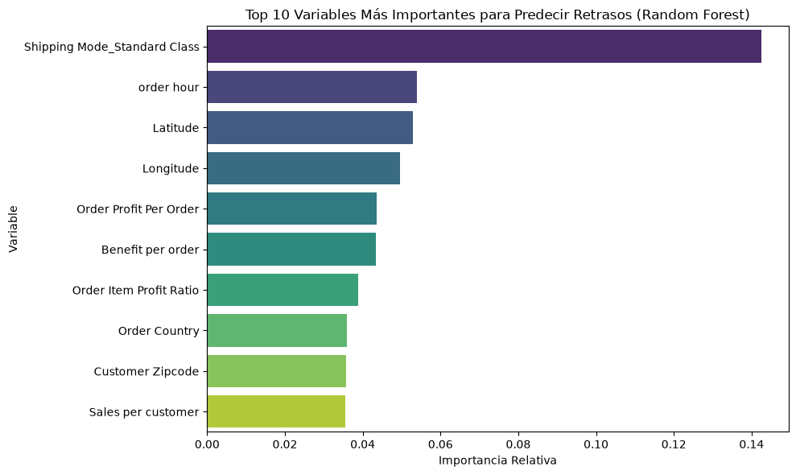

# 🚚 Predicción de Riesgo de Retraso en Entregas Logísticas (DataCo)

Este proyecto implementa un modelo de Machine Learning de extremo a extremo para predecir si una orden logística sufrirá retrasos en la entrega, permitiendo a la operación tomar decisiones preventivas.

## 📌 Contexto del Problema
En la industria logística, los retrasos en las entregas generan altos costos operativos y dañan la satisfacción del cliente. El objetivo principal fue construir un clasificador capaz de identificar órdenes en riesgo utilizando variables operativas, geográficas y temporales registradas al momento de generar la compra.

* **Dataset:** DataCo Smart Supply Chain (disponible en Kaggle).
* **Target:** `Delivery Status` (retraso vs. entrega a tiempo).

---

## 🛠️ Metodología y Fases del Proyecto

1. **Análisis Exploratorio y Limpieza:** Tratamiento de datos nulos y evaluación de distribuciones.
2. **Feature Engineering y Control de Data Leakage:** Eliminación crítica de variables posteriores a la entrega (como días reales de envío o fechas de recepción) para garantizar un escenario de predicción realista.
3. **Modelado Comparativo:**
   * **Random Forest (Modelo Elegido):** Accuracy: **76.47%** | Recall (Retrasos): **0.69**
   * **XGBoost:** Accuracy: 73.91%
   * **LightGBM:** Accuracy: 73.83%
4. **Despliegue:** Creación de una aplicación interactiva con **Streamlit** para evaluar el riesgo en tiempo real.

---

## 📊 Importancia de Variables

El análisis de características determinó que el **modo de envío estándar**, la **hora en que se realiza la orden** y la **ubicación geográfica de destino (latitud/longitud)** son las variables con mayor peso predictivo.



---

## 🚀 Cómo ejecutar la App de Streamlit Localmente

1. Clonar el repositorio:
   ```bash
   git clone [https://github.com/tu-usuario/dataco-supplychain-delay-prediction.git](https://github.com/tu-usuario/dataco-supplychain-delay-prediction.git)
   cd dataco-supplychain-delay-prediction

2. Instalar dependencias:
  ```bash
  pip install streamlit pandas joblib scikit-learn

3. Ejecutar la aplicacion:
  ```bash
  streamlit run app.py

📁 Estructura del Repositorio
notebooks/: Cuaderno Jupyter con el flujo completo de EDA, limpieza y modelado.

app.py: Script de la aplicación interactiva en Streamlit.

random_forest_model.pkl: Modelo Random Forest entrenado y comprimido.

model_columns.pkl: Estructura de columnas requeridas por el modelo.

